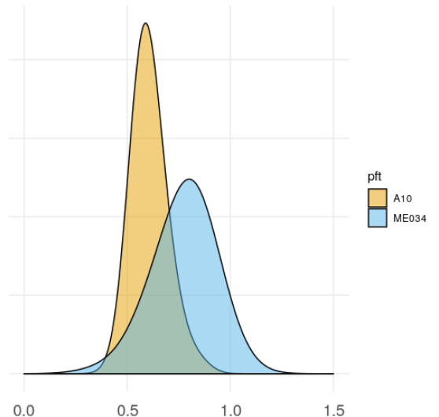

How to Run the BioCro Model Using PEcAn for DARPA Data
================
Kristina Riemer, University of Arizona

This vignette shows how to run the BioCro model using DARPA data for the
species *Setaria viridis* on the University of Arizona’s server Welsch.
The first section details how to run the model for wild type *Setaria*
using only data for specific leaf area, and produces plots of biomass
results. The second is for running the model on two cultivars of
*Setaria*, A10 and ME034, including cultivar-specific data for most
priors.

# Section 1: BioCro Run for *Setaria* PFT

1.  Access RStudio in a browser by navigating to
    <welsch.cyverse.org:8787/>. Log in using your username and password,
    which can be requested [here]().

2.  Create a new folder that will hold the necessary files for the run
    in your home directory by going to the Terminal tab and typing in
    `mkdir biocro_darpa_files`. This new folder should appear in your
    file structure under the Files tab.

3.  The first needed file is an XML that contains the configuration
    information required to get the data and run the model. This example
    run is for the Setaria wild type PFT for a site at the Donald
    Danforth Center in St. Louis, MO using weather data from the entire
    year of 2004. This runs a meta-analysis on specific leaf area (SLA),
    sensitivity analysis and variance decomposition on eight parameters,
    and 200 ensemble runs for total biomass.
    
    Create the file by clicking the new file button with the green plus
    sign in the upper left hand corner and selecting text file. Copy and
    paste the content below into this file, click the save button, and
    save this file as `pecan.biocro.darpa.xml` in the
    `biocro_darpa_files` folder.

<!-- end list -->

``` r
<pecan>
  <outdir>biocro_darpa_results</outdir>

  <database>
    <bety>
      <driver>PostgreSQL</driver>
      <user>bety</user>
      <password>bety</password>
      <host>postgres</host>
      <dbname>bety</dbname>
      <write>FALSE</write>
    </bety>
    <dbfiles>biocro_darpa_results/dbfiles</dbfiles>
  </database>

  <pfts>
    <pft>
      <name>SetariaWT</name>
    </pft>
  </pfts>

  <ensemble>
    <size>200</size>
    <variable>TotLivBiom</variable>
  </ensemble>

  <meta.analysis>
    <iter>3000</iter>
    <random.effects>TRUE</random.effects>
    <threshold>1.2</threshold>
    <update>AUTO</update>
  </meta.analysis>

  <sensitivity.analysis>
    <variable>TotLivBiom</variable>
  </sensitivity.analysis>

  <model>
    <type>BIOCRO</type>
    <binary>/home/kristinariemer/pecan/models/biocro/inst/biocro.Rscript</binary>
    <revision>0.95</revision>
  </model>

  <run>
    <site>
      <id>9000000004</id>
    </site>
    <inputs>
      <met>
        <output>BIOCRO</output>
        <path>/home/kristinariemer/pecan/models/biocro/tests/testthat/data/US-Bo1</path>
      </met>
    </inputs>
      <start.date>2004/01/01</start.date>
      <end.date>2004/12/30</end.date>
    <host>
      <name>localhost</name>
    </host>
  </run>
</pecan>
```

4.  The second file that needs to be created is an R script that runs
    through all of PEcAn’s functions to run the model and produce the
    output. Create this file by clicking on the new file button and
    selecting R script. Copy and paste the below text into the new
    script and save in the `biocro_darpa_files` folder as `workflow.R`.

<!-- end list -->

``` r
#!/usr/bin/env Rscript
#-------------------------------------------------------------------------------
# Copyright (c) 2012 University of Illinois, NCSA.
# All rights reserved. This program and the accompanying materials
# are made available under the terms of the 
# University of Illinois/NCSA Open Source License
# which accompanies this distribution, and is available at
# http://opensource.ncsa.illinois.edu/license.html
#-------------------------------------------------------------------------------

# ----------------------------------------------------------------------
# Load required libraries
# ----------------------------------------------------------------------
library(PEcAn.all)
library(PEcAn.utils)
library(RCurl)

# make sure always to call status.end
options(warn=1)
options(error=quote({
  PEcAn.utils::status.end("ERROR")
  PEcAn.remote::kill.tunnel(settings)
  if (!interactive()) {
    q(status = 1)
  }
}))

#options(warning.expression=status.end("ERROR"))


# ----------------------------------------------------------------------
# PEcAn Workflow
# ----------------------------------------------------------------------
# Open and read in settings file for PEcAn run.
args <- commandArgs(trailingOnly = TRUE)
if (is.na(args[1])){
  settings <- PEcAn.settings::read.settings("pecan.xml") 
} else {
  settings.file <- args[1]
  settings <- PEcAn.settings::read.settings(settings.file)
}

# Check for additional modules that will require adding settings
if("benchmarking" %in% names(settings)){
  library(PEcAn.benchmark)
  settings <- papply(settings, read_settings_BRR)
}

if("sitegroup" %in% names(settings)){
  if(is.null(settings$sitegroup$nSite)){
    settings <- PEcAn.settings::createSitegroupMultiSettings(settings, 
                                                             sitegroupId = settings$sitegroup$id)
  } else {
    settings <- PEcAn.settings::createSitegroupMultiSettings(settings, 
                                                             sitegroupId = settings$sitegroup$id,
                                                             nSite = settings$sitegroup$nSite)
  }
  settings$sitegroup <- NULL ## zero out so don't expand a second time if re-reading
}

# Update/fix/check settings. Will only run the first time it's called, unless force=TRUE
settings <- PEcAn.settings::prepare.settings(settings, force = FALSE)

# Write pecan.CHECKED.xml
PEcAn.settings::write.settings(settings, outputfile = "pecan.CHECKED.xml")

# start from scratch if no continue is passed in
statusFile <- file.path(settings$outdir, "STATUS")
if (length(which(commandArgs() == "--continue")) == 0 && file.exists(statusFile)) {
  file.remove(statusFile)
}

# Do conversions
settings <- PEcAn.workflow::do_conversions(settings)

# Query the trait database for data and priors
if (PEcAn.utils::status.check("TRAIT") == 0){
  PEcAn.utils::status.start("TRAIT")
  settings <- PEcAn.workflow::runModule.get.trait.data(settings)
  PEcAn.settings::write.settings(settings, outputfile='pecan.TRAIT.xml')
  PEcAn.utils::status.end()
} else if (file.exists(file.path(settings$outdir, 'pecan.TRAIT.xml'))) {
  settings <- PEcAn.settings::read.settings(file.path(settings$outdir, 'pecan.TRAIT.xml'))
}

# Run the PEcAn meta.analysis
if(!is.null(settings$meta.analysis)) {
  if (PEcAn.utils::status.check("META") == 0){
    PEcAn.utils::status.start("META")
    PEcAn.MA::runModule.run.meta.analysis(settings)
    PEcAn.utils::status.end()
  }
}

# Write model specific configs
if (PEcAn.utils::status.check("CONFIG") == 0){
  PEcAn.utils::status.start("CONFIG")
  settings <- PEcAn.workflow::runModule.run.write.configs(settings)
  PEcAn.settings::write.settings(settings, outputfile='pecan.CONFIGS.xml')
  PEcAn.utils::status.end()
} else if (file.exists(file.path(settings$outdir, 'pecan.CONFIGS.xml'))) {
  settings <- PEcAn.settings::read.settings(file.path(settings$outdir, 'pecan.CONFIGS.xml'))
}

if ((length(which(commandArgs() == "--advanced")) != 0) && 
    (PEcAn.utils::status.check("ADVANCED") == 0)) {
  PEcAn.utils::status.start("ADVANCED")
  q();
}

# Start ecosystem model runs
if (PEcAn.utils::status.check("MODEL") == 0) {
  PEcAn.utils::status.start("MODEL")
  PEcAn.remote::runModule.start.model.runs(settings, stop.on.error = FALSE)
  PEcAn.utils::status.end()
}

# Get results of model runs
if (PEcAn.utils::status.check("OUTPUT") == 0) {
  PEcAn.utils::status.start("OUTPUT")
  runModule.get.results(settings)
  PEcAn.utils::status.end()
}

# Run ensemble analysis on model output.
if ('ensemble' %in% names(settings) & PEcAn.utils::status.check("ENSEMBLE") == 0) {
  PEcAn.utils::status.start("ENSEMBLE")
  runModule.run.ensemble.analysis(settings, TRUE)
  PEcAn.utils::status.end()
}

# Run sensitivity analysis and variance decomposition on model output
if ('sensitivity.analysis' %in% names(settings) & PEcAn.utils::status.check("SENSITIVITY") == 0) {
  PEcAn.utils::status.start("SENSITIVITY")
  runModule.run.sensitivity.analysis(settings)
  PEcAn.utils::status.end()
}

# Run parameter data assimilation
if ('assim.batch' %in% names(settings)) {
  if (PEcAn.utils::status.check("PDA") == 0) {
    PEcAn.utils::status.start("PDA")
    settings <- PEcAn.assim.batch::runModule.assim.batch(settings)
    PEcAn.utils::status.end()
  }
}

# Run state data assimilation
if ('state.data.assimilation' %in% names(settings)) {
  if (PEcAn.utils::status.check("SDA") == 0) {
    PEcAn.utils::status.start("SDA")
    settings <- sda.enfk(settings)
    PEcAn.utils::status.end()
  }
}

# Run benchmarking
if("benchmarking" %in% names(settings) & "benchmark" %in% names(settings$benchmarking)){
  PEcAn.utils::status.start("BENCHMARKING")
  results <- papply(settings, function(x) calc_benchmark(x, bety))
  PEcAn.utils::status.end()
}

# Pecan workflow complete
if (PEcAn.utils::status.check("FINISHED") == 0) {
  PEcAn.utils::status.start("FINISHED")
  PEcAn.remote::kill.tunnel(settings)
  db.query(paste("UPDATE workflows SET finished_at=NOW() WHERE id=",
                 settings$workflow$id, "AND finished_at IS NULL"),
           params = settings$database$bety)
  
  # Send email if configured
  if (!is.null(settings$email) && !is.null(settings$email$to) && (settings$email$to != "")) {
    sendmail(settings$email$from, settings$email$to,
             paste0("Workflow has finished executing at ", base::date()),
             paste0("You can find the results on ", settings$email$url))
  }
  PEcAn.utils::status.end()
}

db.print.connections()
print("---------- PEcAn Workflow Complete ----------")
```

5.  We will then run the newly created XML file through the R script.
    Then in the Terminal run `biocro_darpa_files/workflow.R --settings
    biocro_darpa_files/pecan.biocro.darpa.xml`.
    
    If this returns an error that says `Permission denied`, first run
    `chmod u+x biocro_darpa_files/workflow.R` in the terminal to get
    sufficient permissions to the newly created workflow.R file. Then
    reattempt running the workflow. If the error occurs again, run
    `chmod u+x biocro_darpa_files/pecan.biocro.darpa.xml`.
    
    This will take a few minutes to finish. The last line in the console
    should appear as follows.

<!-- end list -->

``` r
[1] "---------- PEcAn Workflow Complete ----------"
```

6.  The results for these files will appear in a new folder called
    `biocro_darpa_results`.
    
    To test if this works, you can plot the results from the ensemble
    runs for biomass. The following code will produce a plot of the time
    series throughout a year of biomass, of the median, 25th quantile,
    and 75th quantile for each time step. Create a new R script, copy
    and paste this code into the script, and run it to produce the
    figure.

<!-- end list -->

``` r
# Ensemble Plots
library(ggplot2)
library(data.table)

## Biomass Distributions
load("~/biocro_darpa_results/ensemble.output.NOENSEMBLEID.TotLivBiom.2004.2004.Rdata")
ens <- cbind(as.data.frame(t(data.frame(ensemble.output))))
colnames(ens) <- "TotLivBiom"
theme_set(theme_minimal() + 
            theme(axis.text.x = 
                    element_text(vjust = -1), 
                  axis.text.y = element_blank(),
                  axis.ticks = element_blank(), 
                  axis.line = element_blank(), 
                  axis.title.x = element_blank(), 
                  axis.title.y = element_blank(), 
                  panel.grid.minor = element_blank(), 
                  panel.border = element_blank()))
ggplot(data = ens) +
  geom_density(aes(x = TotLivBiom))

## Biomass Time Series with Quantiles
load('~/biocro_darpa_results/out/SA-median/biocro_output.RData')
timeseries <- data.table(day = rep(biocro_result$doy, each = 24), hour = 0:23)
rm(biocro_result)

load("~/biocro_darpa_results/ensemble.ts.NOENSEMBLEID.TotLivBiom.2004.2004.Rdata")
ens2 <- t(ensemble.ts[['TotLivBiom']])

ens2[is.na(ens2)] <- 0
mean <- rowMeans(ens2, na.rm = TRUE)
median <- apply(ens2, 1, function(x) median(x, na.rm = TRUE))
sd <- apply(ens2, 1, function(x) sd(x, na.rm = TRUE))
lcl <- apply(ens2, 1, function(x) quantile(x, probs = c(0.025), na.rm = TRUE))
ucl <- apply(ens2, 1, function(x) quantile(x, probs = c(0.975), na.rm = TRUE))

data_table <- data.table(timeseries, cbind(mean = mean, median = median, 
                                           sd = sd, lcl = lcl, ucl = ucl))
data_table_day <- data_table[, list(mean = sum(mean),  median = sum(median), sd = sqrt(sum(sd^2)),
                                    lcl = sum(lcl), ucl = sum(ucl)), by = day]

daily_bio <- data.frame(data_table_day)
sd_scale <- 5
ggplot(data = daily_bio) + 
  geom_line(aes(day, y = mean)) +
  geom_ribbon(aes(day, ymin = mean - sd_scale * sd, ymax = mean + sd_scale * sd), alpha = 0.1) +
  geom_ribbon(aes(day, ymin = lcl, ymax = ucl), alpha = 0.1) +
  xlab("Day of Year") + 
  ylab("Total Biomass Mg/ha") +
  theme_classic()
```


# Section 2: BioCro Run for Multiple *Setaria* Cultivars

1.  Access RStudio in a browser by navigating to
    <welsch.cyverse.org:8787/>. Log in using your username and password.

2.  Create two new folders, one for each cultivar, called
    `biocro_darpa_a10_files` and `biocro_darpa_me034_files`.

3.  Create two new XML files, one for each cultivar, that contain
    configuration information rquired to get the data and run the model
    for both. The first is for the Setaria A10 cultivar, while the
    second is for ME034 cultivar. This uses weather data for all of 2004
    at the Donald Danforth Center. These both run meta-analyses for
    stomatal slope, SLA, leaf dark respiration, and Vcmax for both
    cultivars and additionally cuticular conductance for A10.
    Sensitivity and variance decomposition analyses are completed on
    eight parameters, and 200 ensemble runs for total biomass.
    
    Call these files `pecan.biocro.darpa.a10.xml` and
    `pecan.biocro.darpa.me034.xml`, respectively, and place in their
    appropriate folders.

**A10 XML**

``` r
<pecan>
  <outdir>biocro_darpa_a10_results</outdir>

  <database>
    <bety>
      <driver>PostgreSQL</driver>
      <user>bety</user>
      <password>bety</password>
      <host>postgres</host>
      <dbname>bety</dbname>
      <write>FALSE</write>
    </bety>
    <dbfiles>biocro_darpa_a10_results/dbfiles</dbfiles>
  </database>

  <pfts>
    <pft>
      <name>SetariaWT_A10</name>
    </pft>
  </pfts>

  <ensemble>
    <size>200</size>
    <variable>TotLivBiom</variable>
  </ensemble>

  <meta.analysis>
    <iter>3000</iter>
    <random.effects>TRUE</random.effects>
    <threshold>1.2</threshold>
    <update>AUTO</update>
  </meta.analysis>

  <sensitivity.analysis>
    <variable>TotLivBiom</variable>
  </sensitivity.analysis>

  <model>
    <type>BIOCRO</type>
    <binary>/home/kristinariemer/pecan/models/biocro/inst/biocro.Rscript</binary>
    <revision>0.95</revision>
  </model>

  <run>
    <site>
      <id>9000000004</id>
    </site>
    <inputs>
      <met>
        <output>BIOCRO</output>
        <path>/home/kristinariemer/pecan/models/biocro/tests/testthat/data/US-Bo1</path>
      </met>
    </inputs>
      <start.date>2004/01/01</start.date>
      <end.date>2004/12/30</end.date>
    <host>
      <name>localhost</name>
    </host>
  </run>
</pecan>
```

**ME034 XML**

``` r
<pecan>
  <outdir>biocro_darpa_me034_results</outdir>

  <database>
    <bety>
      <driver>PostgreSQL</driver>
      <user>bety</user>
      <password>bety</password>
      <host>postgres</host>
      <dbname>bety</dbname>
      <write>FALSE</write>
    </bety>
    <dbfiles>biocro_darpa_me034_results/dbfiles</dbfiles>
  </database>

  <pfts>
    <pft>
      <name>SetariaWT_ME034</name>
    </pft>
  </pfts>

  <ensemble>
    <size>200</size>
    <variable>TotLivBiom</variable>
  </ensemble>

  <meta.analysis>
    <iter>3000</iter>
    <random.effects>TRUE</random.effects>
    <threshold>1.2</threshold>
    <update>AUTO</update>
  </meta.analysis>

  <sensitivity.analysis>
    <variable>TotLivBiom</variable>
  </sensitivity.analysis>

  <model>
    <type>BIOCRO</type>
    <binary>/home/kristinariemer/pecan/models/biocro/inst/biocro.Rscript</binary>
    <revision>0.95</revision>
  </model>

  <run>
    <site>
      <id>9000000004</id>
    </site>
    <inputs>
      <met>
        <output>BIOCRO</output>
        <path>/home/kristinariemer/pecan/models/biocro/tests/testthat/data/US-Bo1</path>
      </met>
    </inputs>
      <start.date>2004/01/01</start.date>
      <end.date>2004/12/30</end.date>
    <host>
      <name>localhost</name>
    </host>
  </run>
</pecan>
```

4.  The second set of files that need to be created are the `workflow.R`
    for each cultivar. These are the same for both cultivars, so the
    below can be used to create a `workflow.R` in each of the two
    cultivars’ folders.

<!-- end list -->

``` r
#!/usr/bin/env Rscript
#-------------------------------------------------------------------------------
# Copyright (c) 2012 University of Illinois, NCSA.
# All rights reserved. This program and the accompanying materials
# are made available under the terms of the 
# University of Illinois/NCSA Open Source License
# which accompanies this distribution, and is available at
# http://opensource.ncsa.illinois.edu/license.html
#-------------------------------------------------------------------------------

# ----------------------------------------------------------------------
# Load required libraries
# ----------------------------------------------------------------------
library(PEcAn.all)
library(PEcAn.utils)
library(RCurl)

# make sure always to call status.end
options(warn=1)
options(error=quote({
  PEcAn.utils::status.end("ERROR")
  PEcAn.remote::kill.tunnel(settings)
  if (!interactive()) {
    q(status = 1)
  }
}))

#options(warning.expression=status.end("ERROR"))


# ----------------------------------------------------------------------
# PEcAn Workflow
# ----------------------------------------------------------------------
# Open and read in settings file for PEcAn run.
args <- commandArgs(trailingOnly = TRUE)
if (is.na(args[1])){
  settings <- PEcAn.settings::read.settings("pecan.xml") 
} else {
  settings.file <- args[1]
  settings <- PEcAn.settings::read.settings(settings.file)
}

# Check for additional modules that will require adding settings
if("benchmarking" %in% names(settings)){
  library(PEcAn.benchmark)
  settings <- papply(settings, read_settings_BRR)
}

if("sitegroup" %in% names(settings)){
  if(is.null(settings$sitegroup$nSite)){
    settings <- PEcAn.settings::createSitegroupMultiSettings(settings, 
                                                             sitegroupId = settings$sitegroup$id)
  } else {
    settings <- PEcAn.settings::createSitegroupMultiSettings(settings, 
                                                             sitegroupId = settings$sitegroup$id,
                                                             nSite = settings$sitegroup$nSite)
  }
  settings$sitegroup <- NULL ## zero out so don't expand a second time if re-reading
}

# Update/fix/check settings. Will only run the first time it's called, unless force=TRUE
settings <- PEcAn.settings::prepare.settings(settings, force = FALSE)

# Write pecan.CHECKED.xml
PEcAn.settings::write.settings(settings, outputfile = "pecan.CHECKED.xml")

# start from scratch if no continue is passed in
statusFile <- file.path(settings$outdir, "STATUS")
if (length(which(commandArgs() == "--continue")) == 0 && file.exists(statusFile)) {
  file.remove(statusFile)
}

# Do conversions
settings <- PEcAn.workflow::do_conversions(settings)

# Query the trait database for data and priors
if (PEcAn.utils::status.check("TRAIT") == 0){
  PEcAn.utils::status.start("TRAIT")
  settings <- PEcAn.workflow::runModule.get.trait.data(settings)
  PEcAn.settings::write.settings(settings, outputfile='pecan.TRAIT.xml')
  PEcAn.utils::status.end()
} else if (file.exists(file.path(settings$outdir, 'pecan.TRAIT.xml'))) {
  settings <- PEcAn.settings::read.settings(file.path(settings$outdir, 'pecan.TRAIT.xml'))
}

# Run the PEcAn meta.analysis
if(!is.null(settings$meta.analysis)) {
  if (PEcAn.utils::status.check("META") == 0){
    PEcAn.utils::status.start("META")
    PEcAn.MA::runModule.run.meta.analysis(settings)
    PEcAn.utils::status.end()
  }
}

# Write model specific configs
if (PEcAn.utils::status.check("CONFIG") == 0){
  PEcAn.utils::status.start("CONFIG")
  settings <- PEcAn.workflow::runModule.run.write.configs(settings)
  PEcAn.settings::write.settings(settings, outputfile='pecan.CONFIGS.xml')
  PEcAn.utils::status.end()
} else if (file.exists(file.path(settings$outdir, 'pecan.CONFIGS.xml'))) {
  settings <- PEcAn.settings::read.settings(file.path(settings$outdir, 'pecan.CONFIGS.xml'))
}

if ((length(which(commandArgs() == "--advanced")) != 0) && 
    (PEcAn.utils::status.check("ADVANCED") == 0)) {
  PEcAn.utils::status.start("ADVANCED")
  q();
}

# Start ecosystem model runs
if (PEcAn.utils::status.check("MODEL") == 0) {
  PEcAn.utils::status.start("MODEL")
  PEcAn.remote::runModule.start.model.runs(settings, stop.on.error = FALSE)
  PEcAn.utils::status.end()
}

# Get results of model runs
if (PEcAn.utils::status.check("OUTPUT") == 0) {
  PEcAn.utils::status.start("OUTPUT")
  runModule.get.results(settings)
  PEcAn.utils::status.end()
}

# Run ensemble analysis on model output.
if ('ensemble' %in% names(settings) & PEcAn.utils::status.check("ENSEMBLE") == 0) {
  PEcAn.utils::status.start("ENSEMBLE")
  runModule.run.ensemble.analysis(settings, TRUE)
  PEcAn.utils::status.end()
}

# Run sensitivity analysis and variance decomposition on model output
if ('sensitivity.analysis' %in% names(settings) & PEcAn.utils::status.check("SENSITIVITY") == 0) {
  PEcAn.utils::status.start("SENSITIVITY")
  runModule.run.sensitivity.analysis(settings)
  PEcAn.utils::status.end()
}

# Run parameter data assimilation
if ('assim.batch' %in% names(settings)) {
  if (PEcAn.utils::status.check("PDA") == 0) {
    PEcAn.utils::status.start("PDA")
    settings <- PEcAn.assim.batch::runModule.assim.batch(settings)
    PEcAn.utils::status.end()
  }
}

# Run state data assimilation
if ('state.data.assimilation' %in% names(settings)) {
  if (PEcAn.utils::status.check("SDA") == 0) {
    PEcAn.utils::status.start("SDA")
    settings <- sda.enfk(settings)
    PEcAn.utils::status.end()
  }
}

# Run benchmarking
if("benchmarking" %in% names(settings) & "benchmark" %in% names(settings$benchmarking)){
  PEcAn.utils::status.start("BENCHMARKING")
  results <- papply(settings, function(x) calc_benchmark(x, bety))
  PEcAn.utils::status.end()
}

# Pecan workflow complete
if (PEcAn.utils::status.check("FINISHED") == 0) {
  PEcAn.utils::status.start("FINISHED")
  PEcAn.remote::kill.tunnel(settings)
  db.query(paste("UPDATE workflows SET finished_at=NOW() WHERE id=",
                 settings$workflow$id, "AND finished_at IS NULL"),
           params = settings$database$bety)
  
  # Send email if configured
  if (!is.null(settings$email) && !is.null(settings$email$to) && (settings$email$to != "")) {
    sendmail(settings$email$from, settings$email$to,
             paste0("Workflow has finished executing at ", base::date()),
             paste0("You can find the results on ", settings$email$url))
  }
  PEcAn.utils::status.end()
}

db.print.connections()
print("---------- PEcAn Workflow Complete ----------")
```

5.  Then for each cultivar, run the new XML file through the workflow
    script. To do this, run `biocro_darpa_a10_files/workflow.R
    --settings biocro_darpa_a10_files/pecan.biocro.darpa.a10.xml` in the
    Terminal, and then run `biocro_darpa_me034_files/workflow.R
    --settings biocro_darpa_me034_files/pecan.biocro.darpa.me034.xml`.
    This will take 5-10 minutes to finish for each due to the number of
    ensemble runs.

6.  The results for the two cultivars will appear in two new folders,
    called `biocro_darpa_a10_results` and `biocro_darpa_me034_results`.
    
    To test if this works, you can use the following code to plot the
    parameters from the two cultivars together, the sensitivity and
    variance decomposition results for each parameter, and the biomass
    distributions and time series.

<!-- end list -->

``` r
### Parameters
library(dplyr)
library(ggplot2)
library(PEcAn.utils)
fontsize = list(title = 18, axis = 14)
theme_set(theme_minimal() + 
            theme(axis.text.x = 
                    element_text(
                      size = fontsize$axis, 
                                 vjust = -1), 
                  axis.text.y = element_blank(),
                  axis.ticks = element_blank(), 
                  axis.line = element_blank(), 
                  axis.title.x = element_blank(), 
                  axis.title.y = element_blank(), 
                  panel.grid.minor = element_blank(), 
                  panel.border = element_blank()))
samples <- list()

d <- data.frame(directory = c('biocro_darpa_a10_results', 'biocro_darpa_me034_results'),
                pft = c('SetariaWT_A10', 'SetariaWT_ME034'))
for(i in 1:2){
  dir <- d$directory[i]
  pft <- d$pft[i]
  load(file.path('/home/kristinariemer', dir,'samples.Rdata'))
  z <- lapply(trait.samples[[1]], function(x) as.numeric(x)[1:20000])
  samples[[pft]] <- cbind(pft = pft, tidyr::gather(bind_rows(z)))
}
parms <- bind_rows(samples) %>% 
  transmute(pft = pft, 
            trait = key, 
            value = value, 
            trait.labels = as.character(trait.lookup(key)$figid))
p <- parms# %>% filter(pft %in% c("hardwood-priors", "salix-miyabeana", "salix-purpurea"))

z <- ggplot(data = p) + 
  geom_density(aes(value, fill = pft), alpha = 0.25) + 
  facet_wrap(~trait.labels, ncol = 1, scales = 'free') + #trait.labels to trait
  expand_limits(x=0) +
  scale_fill_manual(values=c("#E69F00", "#56B4E9"))

z

options(digits=2, scientific = FALSE)
param_summary <- p %>% group_by(pft, trait) %>% summarize(mean = mean(value, na.rm = TRUE), sd = sd(value, na.rm = TRUE), 
                                                          lcl95 = quantile(value, 0.025, na.rm = TRUE),
                                                          ucl95 = quantile(value, 0.975, na.rm = TRUE))
param_summary %>% 
  dplyr::mutate_if(is.numeric, funs(as.character(signif(., 3)))) %>%
  knitr::kable()

## SA / VD

library(data.table)

variables <- c('TotLivBiom')# also 'StemBiom', 'TVeg') 
vd.plots <- new.vdplots <- list()
vd.output <- list()

variable <- variables[1]
vd.output[[variable]] <- list()
for(i in 1:2){ #loop over pfts
  pft <- as.character(d$pft[i])
  dir <- file.path('/home/kristinariemer', d$directory[i])
  
  
  load(file.path(dir, 
                 paste0("sensitivity.results.NOENSEMBLEID.", 
                        variable, ".2004.2004.Rdata")))
  
  .t <- sensitivity.results[[pft]]$variance.decomposition.output 
  .t2 <- data.table(trait = names(.t$coef.vars), 
                    pft = pft, 
                    as.data.table(.t))
  vd.output[[variable]][[pft]] <- .t2
}


vd.yield <- rbindlist(vd.output$TotLivBiom)
vd.yield$variable <- 'TotLivBiom'

#out <- rbind(vd.yield, vd.transpiration)[, `:=`(
out <- rbind(vd.yield)[, `:=`( ## strange syntax is from data.table
  trait.labels = as.character(trait.lookup(trait)$figid),
  units = trait.lookup(trait)$units,
  coef.vars = coef.vars * 100,
  sd = sqrt(variances))]
out$trait.labels <- factor(out$trait.labels)
out$pft <- factor(out$pft)

fontsize = list(title = 18, axis = 14)


vdplots <- list()
for(var in variables){
  a <- out[variable == var]# & pft != 'salix']
  if(var == "TVeg") {
    a$sd <- a$sd * 60 * 60 * 24 # convert /s to /d
  }
  
  cv <- ggplot(data = a) + 
    geom_pointrange(aes(x = trait.labels, y = coef.vars, 
                        ymin = 0,  ymax = coef.vars, color = pft), alpha = 0.5, 
                    position=position_dodge(width=c(-0.4)), size = 1.25) + 
    coord_flip() +
    ggtitle("CV %") + guides(color = FALSE) +  
    scale_color_manual(values=c("#E69F00", "#56B4E9")) +
    theme(axis.text.y = element_text(color = 'black', hjust = 1, size = fontsize$axis)) + 
    geom_segment( aes(x = 0, y = 0, 
                      xend = 0, yend = max(pretty(coef.vars))), size = 0.1) + geom_hline(aes(yintercept = 0), size = 0.1)
  
  
  el <- ggplot() + 
    geom_pointrange(data = a, aes(x = trait.labels, y = elasticities, 
                                  ymin = 0,  ymax = elasticities, color = pft), alpha = 0.5,
                    position=position_dodge(width=c(-0.4)), size = 1.25) + 
    coord_flip() +   
    ggtitle("Elasticity") + guides(color = FALSE) +
    scale_color_manual(values=c("#E69F00", "#56B4E9")) +
    theme(plot.title = element_text(hjust = 0.5)) + 
    geom_segment( aes(x = 0, y = min(pretty(a$elasticities)), 
                      xend = 0, yend = max(pretty(a$elasticities))), size = 0.2) + geom_hline(aes(yintercept = 0), size = 0.1)
  
  
  vd <- ggplot(data = a) + 
    geom_pointrange(aes(x = trait.labels, y = sd, 
                        ymin = 0,  ymax = sd, color = pft), alpha = 0.5,
                    position=position_dodge(width=c(-0.4)), size = 1.25) + 
    coord_flip() +  
    ggtitle("Variance Explained (SD Units)")  +
    scale_color_manual(values=c("#E69F00", "#56B4E9")) +
    geom_segment(data = data.frame(ticks = pretty(c(0, max(a$sd)))), 
                 aes(x = 0, y = 0, xend = 0, yend = max(ticks)), size = 0.1) + geom_hline(aes(yintercept = 0), size = 0.1)
  
  vdplots[[var]] <- gridExtra::grid.arrange(cv, el, vd, ncol = 3)
  
  #  write.csv(a, paste0('~/out/variance_decomposition_', var, '.csv'), row.names = FALSE)
  #  ggsave(vdplots[[var]], filename = paste0('~/out/vdplots_', var, '.png'), width = 16, height = 5)
  
}


## Ensemble

load("/home/kristinariemer/biocro_darpa_a10_results/ensemble.output.NOENSEMBLEID.TotLivBiom.2004.2004.Rdata")
ens <- cbind(runtype = 'A10', as.data.frame(t(data.frame(ensemble.output))))
load("/home/kristinariemer/biocro_darpa_me034_results/ensemble.output.NOENSEMBLEID.TotLivBiom.2004.2004.Rdata")
ens <- rbind(ens, cbind(runtype = 'ME034', as.data.frame(t(data.frame(ensemble.output)))))

colnames(ens) <- c('pft', 'TVeg')
ggplot(data = ens) + geom_density(aes(x = TVeg, fill = pft), adjust = 3, alpha = 0.5) +  
  scale_fill_manual(values=c("#E69F00", "#56B4E9")) + xlim(0,1.5) 


summarize.ensemble <- function(pft, variable){
  load('/home/kristinariemer/biocro_darpa_a10_results/out/SA-median/biocro_output.RData')
  timeseries <- data.table(day = rep(biocro_result$doy, each = 24), hour = 0:23)
  rm(biocro_result)
  
  load(file.path('/home/kristinariemer/', as.character(d[d$pft == pft,]$directory),
                 paste0('ensemble.ts.NOENSEMBLEID.', variable, '.2004.2004.Rdata')))
  ens <- t(ensemble.ts[[variable]])
  ens[is.na(ens)] <- 0
  mean <- rowMeans(ens, na.rm = TRUE)
  median <- apply(ens, 1, function(x) median(x, na.rm = TRUE))
  sd <- apply(ens, 1, function(x) sd(x, na.rm = TRUE))
  lcl <- apply(ens, 1, function(x) quantile(x, probs = c(0.025), na.rm = TRUE))
  ucl <- apply(ens, 1, function(x) quantile(x, probs = c(0.975), na.rm = TRUE))
  
  .dt <- data.table(timeseries, cbind(mean = mean, median = median, 
                                      sd = sd, lcl = lcl, ucl = ucl))
  if(variable == 'TVeg'){
    .dt_day <- .dt[, list(mean = mean(mean),  median = mean(median), sd = sqrt(mean(sd^2)),
                          lcl = mean(lcl), ucl = mean(ucl)), by = day]
  } else {#if (variable == 'StemBiom'){ ### should take mean instead of sum biomass(?)
    .dt_day <- .dt[, list(mean = sum(mean),  median = sum(median), sd = sqrt(sum(sd^2)),
                          lcl = sum(lcl), ucl = sum(ucl)), by = day]
  }
  .dt_day[, `:=`(pft = pft, variable = variable)]
  return(.dt_day)
}

all <- list()

variables <- c('TotLivBiom')
pfts <- as.character(d$pft)


all <- list()
for(variable in variables){
  all[[as.character(variable)]] <- list()
  for(pft in pfts){
    all[[as.character(variable)]][[as.character(pft)]] <- summarize.ensemble(pft = pft, variable = variable)
  }
}

modeled_yield <- rbindlist(all$TotLivBiom)
sd_scale <- 5
p <- ggplot(data = modeled_yield ) + 
  geom_line(aes(day, y = mean, color = pft)) +
  geom_ribbon(aes(day, ymin = mean - sd_scale * sd, ymax = mean + sd_scale * sd, fill = pft), alpha = 0.1) +
  geom_ribbon(aes(day, ymin = lcl, ymax = ucl, fill = pft), alpha = 0.1) +
  xlab("Day of Year") + 
  ylab("Total Biomass Mg/ha") +
  scale_fill_manual(values=c("#E69F00", "#56B4E9")) +
  scale_color_manual(values=c("#E69F00", "#56B4E9")) +
  theme_classic()
p
```


