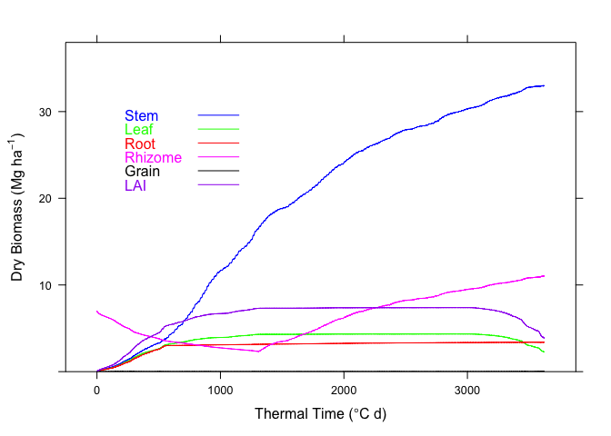
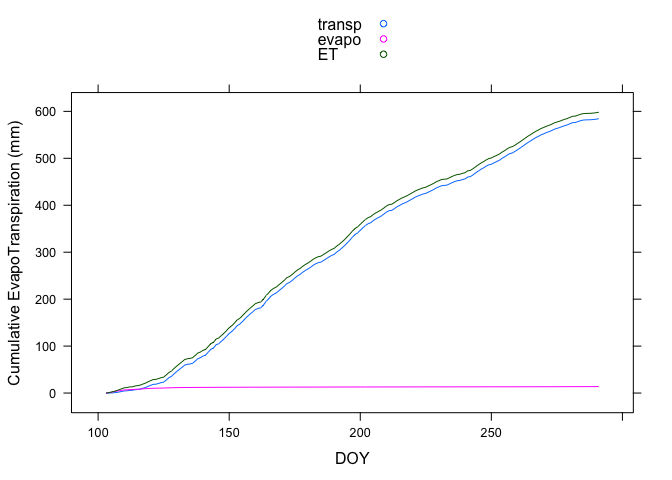
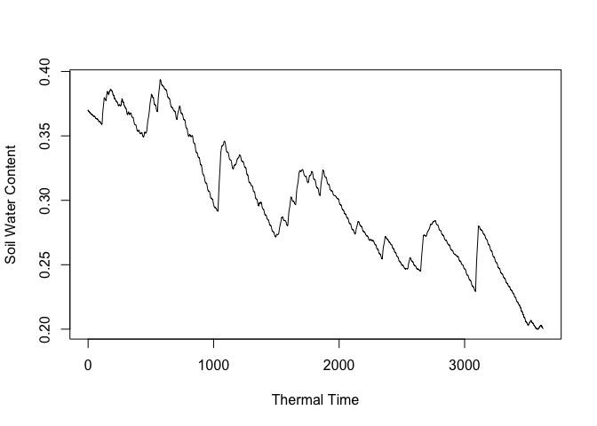
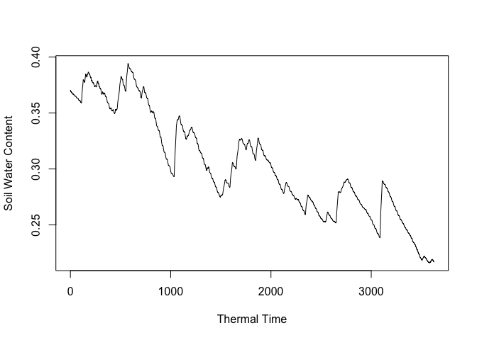

Introduction to BioCro Model
================
Kristina Riemer

## Purpose of model

Simulate growth and photosynthesis of plants using weather and plant
traits.

## Installing package

Run below to install the current stable release of BioCro.

``` r
devtools::install_github('ebimodeling/biocro')
```

Read in the library.

``` r
library(BioCro)
```

## Estimating biomass for growing season

The function `BioGro` is used for this. The only required input is a
year of hourly weather data. Here we’re using such weather data from a
site in Illinois.

This returns a list where each element is a variable resulting from the
model run. This includes biomass values for different parts of the
plants and leaf traits such as stomatal conductance and maximum
carboxylation rate. For a complete list of outputs, see the `Value`
section of the help page for the function (`?BioGro`).

``` r
data(cmi04)
head(cmi04)
```

    ##   year doy hour SolarR       Temp        RH       WS precip
    ## 1 2004   1    0      0  2.5138889 0.9395434 1.945417      0
    ## 2 2004   1    1      0  1.2424834 0.9528131 1.676811      0
    ## 3 2004   1    2      0  0.2668996 0.9611548 1.470702      0
    ## 4 2004   1    3      0 -0.3463780 0.9640000 1.341137      0
    ## 5 2004   1    4      0 -0.5555556 0.9611548 1.296944      0
    ## 6 2004   1    5      0 -0.3463780 0.9528131 1.341137      0

``` r
cmi04_results <- BioGro(cmi04)
```

    ## [1] 6

``` r
names(cmi04_results)
```

    ##  [1] "DayofYear"          "Hour"               "CanopyAssim"       
    ##  [4] "CanopyTrans"        "Leaf"               "Stem"              
    ##  [7] "Root"               "Rhizome"            "Grain"             
    ## [10] "LAI"                "ThermalT"           "SoilWatCont"       
    ## [13] "StomatalCondCoefs"  "LeafReductionCoefs" "LeafNitrogen"      
    ## [16] "AboveLitter"        "BelowLitter"        "VmaxVec"           
    ## [19] "AlphaVec"           "SpVec"              "MinNitroVec"       
    ## [22] "RespVec"            "SoilEvaporation"    "cwsMat"            
    ## [25] "psimMat"            "rdMat"              "SCpools"           
    ## [28] "SNpools"            "LeafPsimVec"

``` r
head(cmi04_results$Stem)
```

    ## [1] 0.00907200 0.01114234 0.01321103 0.01527806 0.01734344 0.01940716

These results can be visualized using `plot`, which is a modified
version of `xyplot` from the `lattice` R package. The default plots the
dry biomass of the different plant parts, and other results can be
plotted by specifying the `plot.kind`. The cumulative evapotranspiration
plot is shown as an example.

``` r
plot(cmi04_results)
```

<!-- -->

``` r
plot(cmi04_results, plot.kind = "cumET")
```

<!-- -->

Many other model parameters can be specified, see the `Arguments`
section for the function (`?BioGro`). For example, information about
soil properties can be added. The model outputs are plotted for low and
high values for the effect of water stress on leaf growth. There is not
a built-in way to plot these.

``` r
low_phi <- soilParms(FieldC = 0.37, WiltP = 0.2, phi2 = 1)
high_phi <- soilParms(FieldC = 0.37, WiltP = 0.2, phi2 = 4)
cmi04_results_lowphi <- BioGro(cmi04, soilControl = low_phi)
```

    ## [1] 6

``` r
cmi04_results_highphi <- BioGro(cmi04, soilControl = high_phi)
```

    ## [1] 6

``` r
plot(cmi04_results_lowphi, plot.kind = "SW")
```

<!-- -->

``` r
plot(cmi04_results_highphi, plot.kind = "SW")
```

<!-- -->

`BioGro` is built on the `c4photo`/`c3photo` and `CanA` functions. Their
use is illustrated below.

## Estimating photosynthesis variables at the leaf level

The function `c4photo` estimates stomatal conductance, net assimilation,
intercellular CO<sub>2</sub>, and gross assimilation from
photosynthetically active radiation, temperature, and relative humidity.
A value for net assimilation is returned below.

``` r
photosynthesis_c4 <- c4photo(Qp = 1500, Tl = 25, RH = 0.7)
photosynthesis_c4$Assim
```

    ## [1] 30.48496

This function can take a lot of other parameters, including Vcmax and
temperature bounds. The example below shows the difference in output
when atmospheric CO<sub>2</sub>
varies.

``` r
photosynthesis_c4_lowco2 <- c4photo(Qp = 1250, Tl = 35, RH = 0.7, Catm = 350)
photosynthesis_c4_highco2 <- c4photo(Qp = 1250, Tl = 35, RH = 0.7, Catm = 400)
photosynthesis_c4_lowco2$Assim
```

    ## [1] 34.39333

``` r
photosynthesis_c4_highco2$Assim
```

    ## [1] 34.45631

Observations of net assimilation rate, quantum flux, leaf temperature,
and relative humidity can be used to better estimate maximum rate of
carboxylation and quantum efficiency to put into `c4photo`/`c3photo`.
Example observations from a built-in dataset are shown.

``` r
library(dplyr)
data(aq)
aq_observations <- aq %>% 
  filter(ID == 1) %>% 
  select(A, PARi, Tleaf, RH_S)
aq_observations
```

    ##       A    PARi Tleaf RH_S
    ## 1 16.68 1988.36 26.88 0.47
    ## 2 17.87 1489.37 26.16 0.47
    ## 3 18.24  993.60 25.39 0.47
    ## 4 15.70  493.78 24.66 0.47
    ## 5 11.10  297.23 24.34 0.47
    ## 6  7.43  193.86 24.39 0.46
    ## 7  3.05   96.43 24.42 0.45
    ## 8  0.46   47.45 24.40 0.44

The function `Opc4photo` takes these observations to produce estimates
of Vmax and alpha.

``` r
aq_observations_priors <- Opc4photo(aq_observations)
aq_observations_priors$bestVmax
```

    ## [1] 19.09404

``` r
aq_observations_priors$bestAlpha
```

    ## [1] 0.05225266

These estimates can also be produced for multiple curves at once
(`mOpc4photo`) or with a Bayesian approach (`MCMCc4photo`).

## Simulate canopy carbon assimilation

Estimates at the canopy-level of carbon assimilation and transpiration
are done with the function `CanA`, which is built on `c4photo`. Required
inputs include environmental variables, day and time, and leaf area
index.

The number of layers in the canopy can also be specified. While the
default is eight layers, an example with more layers is shown. Both
carbon assimilation and transpiration outputs are
shown.

``` r
canopy_fewlayers <- CanA(lai = 3, doy = 200, hr = 12, solar = 1500, temp = 25, 
                         rh = 0.7, windspeed = 2)
canopy_morelayers <- CanA(lai = 3, doy = 200, hr = 12, solar = 1500, temp = 25, 
                          rh = 0.7, windspeed = 2, nlayers = 14)
canopy_fewlayers$CanopyAssim
```

    ## [1] 0.003663916

``` r
canopy_morelayers$CanopyAssim
```

    ## [1] 0.00371193

``` r
canopy_fewlayers$CanopyTrans
```

    ## [1] 0.360428

``` r
canopy_morelayers$CanopyTrans
```

    ## [1] 0.3807981

## Determine biomass partitioning

The function `OpBioGro` is used to estimate the proportion of biomass in
each of five parts of the plant throughout six phenological stages. The
first input this function requires is weather data, including solar
radiation, temperature, relative humidity, wind speed, and
precipitation, at hourly time steps. We use here a built-in dataset from
the `BioCro` package. The second input is the biomass of the different
plant parts across thermal temperature; an example dataset is generated
below.

``` r
data(weather05)
weather_data <- weather05
biomass_data = data.frame(
    ThermalT = c(0.21088112958955, 431.522425672787, 1005.62149992847,
                 1644.3961341225, 2293.29763493264, 2877.88197263589,
                 3414.94836181958, 3746.93356347913),
        Stem = c(0.007329, 1.04151488848428, 5.11942776350724,
                 7.81286730821308, 11.0907005177492, 13.2507662405245,
                 14.4052150630531, 14.7401303915464),
        Leaf = c(0.001036, 0.842484261465219, 1.39383059411517,
                 1.46256196044261, 1.47410120058506, 1.47948442902015,
                 1.07906869265829, 0.450513028403679),
        Root = c(0.007035, 0.112702867880121, 1.20666362376652, 1.928688377409,
                 2.62366412192997, 3.08821592657137, 3.3414401199094,
                 3.52726574823008),
     Rhizome = c(6.9993, 6.58508401628827, 6.1953811812003, 6.44908010432176,
                 8.05287028398554, 9.12491291008107, 9.70927643316885,
                 10.1381048062166),
       Grain = c(0, 0, 0, 0, 0, 0, 0, 0),
         LAI = c(0.00119, 1.43168584789548, 2.3693645451772, 2.48635533275244,
                 2.5059720409946, 2.51512352933425, 1.83441677751909,
                 0.765872148286255)
)
```

The input biomass data is then used to create initial guesses at what
the biomass coefficients for each part of the plant at each phenological
stage will be. This is done using `idbp`, and the results are checked
for errors using `valid_dpb`, which are both `BioCro` functions.

``` r
approx_biomass_coefs <- valid_dbp(idbp(biomass_data))
```

These initial coefficients, along with the weather and biomass data, are
put into `OpBioGro`, which uses both the `BioGro` and `optim` functions.
The `phen` argument is set as zero to return values optimized for all
six stages. Otherwise, a particular stage to optimize can be
specified.

``` r
biomass_coefs <- OpBioGro(phen = 0, WetDat = weather_data, data = biomass_data, 
                          iCoef = approx_biomass_coefs)
```

The “Optimized coefficients” table in `biomass_coefs` contains the
proportions of biomass allocated to each part of the plant in each of
the phenological stages.

``` r
biomass_coefs
```

    ## 
    ##  Optimization for stage: 1 2 3 4 5 6 
    ## 
    ##  Optimized coefficients
    ##           Leaf        Stem       Root       Rhizome        Grain
    ## 1 4.699050e-01 0.480609978 0.04948498 -1.004819e-04 0.000000e+00
    ## 2 6.501908e-01 0.139569458 0.21023973 -9.944771e-05 0.000000e+00
    ## 3 5.606136e-01 0.009623840 0.13020890  2.995536e-01 0.000000e+00
    ## 4 5.579495e-01 0.011222947 0.12925090  3.015766e-01 0.000000e+00
    ## 5 5.664778e-01 0.006169053 0.13258745  2.947657e-01 0.000000e+00
    ## 6 3.110866e-07 0.078591426 0.37649696  5.449107e-01 6.392513e-07
    ## 
    ##  Residual Sum of Squares: 3.267388 
    ## 
    ##  Convergence 
    ##   stage:  1 YES 
    ##   stage:  2 YES 
    ##   stage:  3 YES 
    ##   stage:  4 YES 
    ##   stage:  5 YES 
    ##   stage:  6 YES
