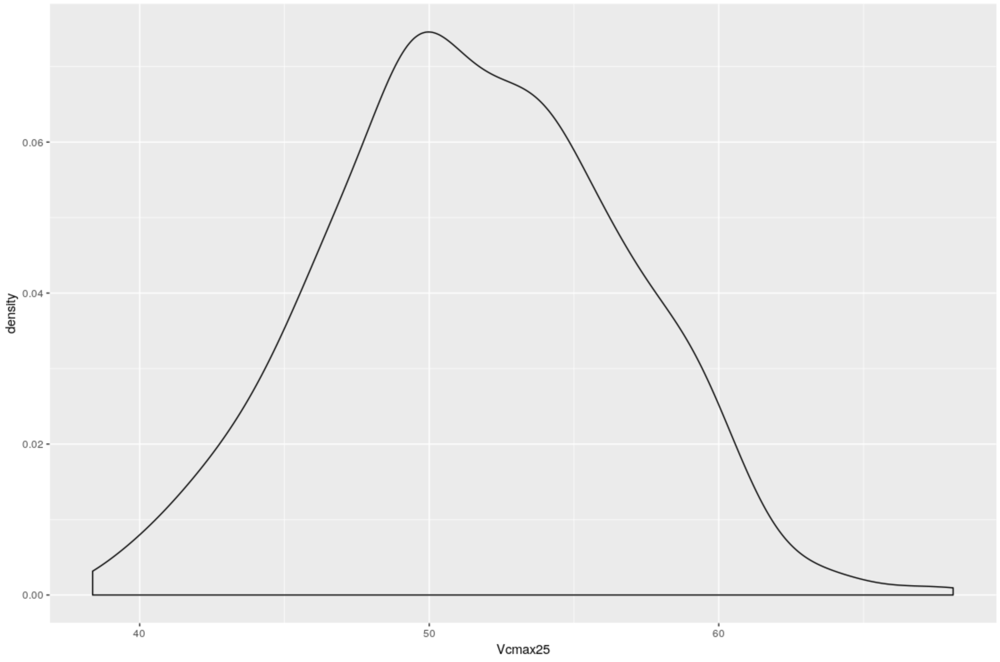

---
output:
  pdf_document: default
  html_document: default
urlcolor: blue
---

# CLM Run Using University of Arizona's RStudio Instance

1. Access RStudio in a browser by navigating to [welsch.cyverse.org:8787/](welsch.cyverse.org:8787/). Log in using your username and password, which can be requested [here](). 

2. Create a new folder that will hold the necessary files for the run in your home directory by going to the Terminal tab and typing in `mkdir clm_files`. This new folder should appear in your file structure under the Files tab. 

3. The first needed file is an XML that contains the configuration information required to get the data and run the model. This example run is for the Sentinel project *Setaria* plants using the CLM default values as the prior distributions. This is for a site just outside of Champaign, Illinois using weather data from the entire year of 2004. We are also running ensemble and sensitivity analyses, and a meta-analysis. 

    Create the file by clicking the new file button with the green plus sign in the upper left hand corner and selecting text file. Copy and paste the content below into this file, click the save button, and save this file as `pecan.clm.params.xml` in the `clm_files` folder. 

```{r, eval=FALSE}
<pecan>
  <outdir>clm_results</outdir>
  <database>
    <bety>
      <user>bety</user>
      <password>bety</password>
      <host>postgres</host>
      <dbname>bety</dbname>
      <driver>PostgreSQL</driver>
      <write>FALSE</write>
    </bety>
    <dbfiles>clm_results/dbfiles</dbfiles>
  </database>
  <pfts>
    <pft>
      <name>Setaria WT priors defaults</name>
    </pft>
  </pfts>
  <ensemble>
    <variable>AbvGrndWood</variable>
    <size>500</size>
  </ensemble>
  <meta.analysis>
    <iter>3000</iter>
    <random.effects>FALSE</random.effects>
  </meta.analysis>
  <sensitivity.analysis>
    <variable>AbvGrndWood</variable>
  </sensitivity.analysis>
  <model>
    <id>9000000001</id>
    <type>CLM50</type>
  </model>
  <run>
    <site>
      <id>753</id>
    </site>
    <inputs>
      <met>
        <output>BIOCRO</output>
        <path>/home/kristinariemer/pecan/models/biocro/tests/testthat/data/US-Bo1</path>
      </met>
    </inputs>
    <start.date>2004/01/01</start.date>
    <end.date>2004/12/31</end.date>
  </run>
  <host>
    <name>localhost</name>
  </host>
</pecan>

```

4. The second file that needs to be created is an R script that runs through all of PEcAn's functions to run the model and produce the output. Create this file by clicking on the new file button and selecting R script. Copy and paste the below text into the new script and save in the `clm_files` folder as `workflow.R`. 

    Note that the second half of this workflow script is commented out, starting with the "Start ecosystem model runs" section. This is because we are only generating the parameters that will go into the model, not yet running CLM within the PEcAn framework. 

```{r, eval=FALSE}
#!/usr/bin/env Rscript
#-------------------------------------------------------------------------------
# Copyright (c) 2012 University of Illinois, NCSA.
# All rights reserved. This program and the accompanying materials
# are made available under the terms of the 
# University of Illinois/NCSA Open Source License
# which accompanies this distribution, and is available at
# http://opensource.ncsa.illinois.edu/license.html
#-------------------------------------------------------------------------------

# ----------------------------------------------------------------------
# Load required libraries
# ----------------------------------------------------------------------
library(PEcAn.all)
library(PEcAn.utils)
library(RCurl)

#system('rm -rf ~/clm_params')
#debugonce(PEcAn.workflow::run.write.configs)
#debugonce(PEcAn.utils::write.sa.configs)
#debugonce(PEcAn.FATES::write.config.FATES)
# make sure always to call status.end

options(warn=1)
options(error=quote({
  PEcAn.utils::status.end("ERROR")
  PEcAn.remote::kill.tunnel(settings)
  if (!interactive()) {
    q(status = 1)
  }
}))

#options(warning.expression=status.end("ERROR"))


# ----------------------------------------------------------------------
# PEcAn Workflow
# ----------------------------------------------------------------------
# Open and read in settings file for PEcAn run.
args <- commandArgs(trailingOnly = TRUE)
if (is.na(args[1])){
  settings <- PEcAn.settings::read.settings("pecan.xml") 
} else {
  settings.file <- args[1]
  settings <- PEcAn.settings::read.settings(settings.file)
}

# Check for additional modules that will require adding settings
if("benchmarking" %in% names(settings)){
  library(PEcAn.benchmark)
  settings <- papply(settings, read_settings_BRR)
}

if("sitegroup" %in% names(settings)){
  if(is.null(settings$sitegroup$nSite)){
    settings <- PEcAn.settings::createSitegroupMultiSettings(settings, 
                                                             sitegroupId = settings$sitegroup$id)
  } else {
    settings <- PEcAn.settings::createSitegroupMultiSettings(settings, 
                                                             sitegroupId = settings$sitegroup$id,
                                                             nSite = settings$sitegroup$nSite)
  }
  settings$sitegroup <- NULL ## zero out so don't expand a second time if re-reading
}

# Update/fix/check settings. Will only run the first time it's called, unless force=TRUE
settings <- PEcAn.settings::prepare.settings(settings, force = FALSE)

# Write pecan.CHECKED.xml
PEcAn.settings::write.settings(settings, outputfile = "pecan.CHECKED.xml")

# start from scratch if no continue is passed in
statusFile <- file.path(settings$outdir, "STATUS")
if (length(which(commandArgs() == "--continue")) == 0 && file.exists(statusFile)) {
  file.remove(statusFile)
}

# Do conversions
settings <- PEcAn.workflow::do_conversions(settings)

# Query the trait database for data and priors
if (PEcAn.utils::status.check("TRAIT") == 0){
  PEcAn.utils::status.start("TRAIT")
  settings <- PEcAn.workflow::runModule.get.trait.data(settings)
  PEcAn.settings::write.settings(settings, outputfile='pecan.TRAIT.xml')
  PEcAn.utils::status.end()
} else if (file.exists(file.path(settings$outdir, 'pecan.TRAIT.xml'))) {
  settings <- PEcAn.settings::read.settings(file.path(settings$outdir, 'pecan.TRAIT.xml'))
}


# Run the PEcAn meta.analysis
if(!is.null(settings$meta.analysis)) {
  if (PEcAn.utils::status.check("META") == 0){
    PEcAn.utils::status.start("META")
    PEcAn.MA::runModule.run.meta.analysis(settings)
    PEcAn.utils::status.end()
  }
}

# Write model specific configs
settings$model$type <- "FATES"
if (PEcAn.utils::status.check("CONFIG") == 0){
  PEcAn.utils::status.start("CONFIG")
  settings <- PEcAn.workflow::runModule.run.write.configs(settings)
  PEcAn.settings::write.settings(settings, outputfile='pecan.CONFIGS.xml')
  PEcAn.utils::status.end()
} else if (file.exists(file.path(settings$outdir, 'pecan.CONFIGS.xml'))) {
  settings <- PEcAn.settings::read.settings(file.path(settings$outdir, 'pecan.CONFIGS.xml'))
}

if ((length(which(commandArgs() == "--advanced")) != 0) && (PEcAn.utils::status.check("ADVANCED") == 0)) {
  PEcAn.utils::status.start("ADVANCED")
  q();
}

# # Start ecosystem model runs
# if (PEcAn.utils::status.check("MODEL") == 0) {
#   PEcAn.utils::status.start("MODEL")
#   PEcAn.remote::runModule.start.model.runs(settings, stop.on.error = FALSE)
#   PEcAn.utils::status.end()
# }
# 
# # Get results of model runs
# if (PEcAn.utils::status.check("OUTPUT") == 0) {
#   PEcAn.utils::status.start("OUTPUT")
#   runModule.get.results(settings)
#   PEcAn.utils::status.end()
# }
# 
# # Run ensemble analysis on model output. 
# if ('ensemble' %in% names(settings) & PEcAn.utils::status.check("ENSEMBLE") == 0) {
#   PEcAn.utils::status.start("ENSEMBLE")
#   runModule.run.ensemble.analysis(settings, TRUE)    
#   PEcAn.utils::status.end()
# }
# 
# # Run sensitivity analysis and variance decomposition on model output
# if ('sensitivity.analysis' %in% names(settings) & PEcAn.utils::status.check("SENSITIVITY") == 0) {
#   PEcAn.utils::status.start("SENSITIVITY")
#   runModule.run.sensitivity.analysis(settings)
#   PEcAn.utils::status.end()
# }
# 
# # Run parameter data assimilation
# if ('assim.batch' %in% names(settings)) {
#   if (PEcAn.utils::status.check("PDA") == 0) {
#     PEcAn.utils::status.start("PDA")
#     settings <- PEcAn.assim.batch::runModule.assim.batch(settings)
#     PEcAn.utils::status.end()
#   }
# }
# 
# # Run state data assimilation
# if ('state.data.assimilation' %in% names(settings)) {
#   if (PEcAn.utils::status.check("SDA") == 0) {
#     PEcAn.utils::status.start("SDA")
#     settings <- sda.enfk(settings)
#     PEcAn.utils::status.end()
#   }
# }
# 
# # Run benchmarking
# if("benchmarking" %in% names(settings) & "benchmark" %in% names(settings$benchmarking)){
#   PEcAn.utils::status.start("BENCHMARKING")
#   results <- papply(settings, function(x) calc_benchmark(x, bety))
#   PEcAn.utils::status.end()
# }
# 
# # Pecan workflow complete
# if (PEcAn.utils::status.check("FINISHED") == 0) {
#   PEcAn.utils::status.start("FINISHED")
#   PEcAn.remote::kill.tunnel(settings)
#   db.query(paste("UPDATE workflows SET finished_at=NOW() WHERE id=", 
#                  settings$workflow$id, "AND finished_at IS NULL"), 
#            params = settings$database$bety)
#   
#   # Send email if configured
#   if (!is.null(settings$email) && !is.null(settings$email$to) && (settings$email$to != "")) {
#     sendmail(settings$email$from, settings$email$to,
#              paste0("Workflow has finished executing at ", base::date()),
#              paste0("You can find the results on ", settings$email$url))
#   }
#   PEcAn.utils::status.end()
# }
# 
# db.print.connections()
# print("---------- PEcAn Workflow Complete ----------")

```

5. We will then run the newly created XML file through the R script. In the Terminal run `clm_files/workflow.R --settings clm_files/pecan.clm.params.xml`. 

You may get this error: `bash: clm_files/workflow.R: Permission denied`. In order to give yourself correct permissions to the new R script, run `chmod u+x clm_files/workflow.R` in the Terminal and then run the previous line again. 

This will take a few minutes to finish. The last line in the console should appear as follows.

```{r, eval=FALSE}
Error in gsub("@REFCASE@", refcase, jobsh) :
  invalid 'replacement' argument
Calls: <Anonymous> ... <Anonymous> -> do.call -> write.config.FATES -> gsub
```

6. To test if this works, create a density plot of one of the parameters, Vcmax, from the ensemble run. We specified 500 runs in the XML, so there are 500 values for each parameter. In the console or a new R script, type the following R command and the plot shown should be generated. This code reads in the output data for the ensemble runs, turns it into a dataframe, and plots it with the `ggplot2` package. 

```{r, eval=FALSE}
library(ggplot2)

load("clm_results/samples.Rdata")
ls()

ensemble_values <- data.frame(ensemble.samples$`Setaria WT priors defaults`)
ggplot(ensemble_values, aes(x = Vcmax25)) +
  geom_density()
```

```{r, echo=FALSE, out.width="400px"}

```
