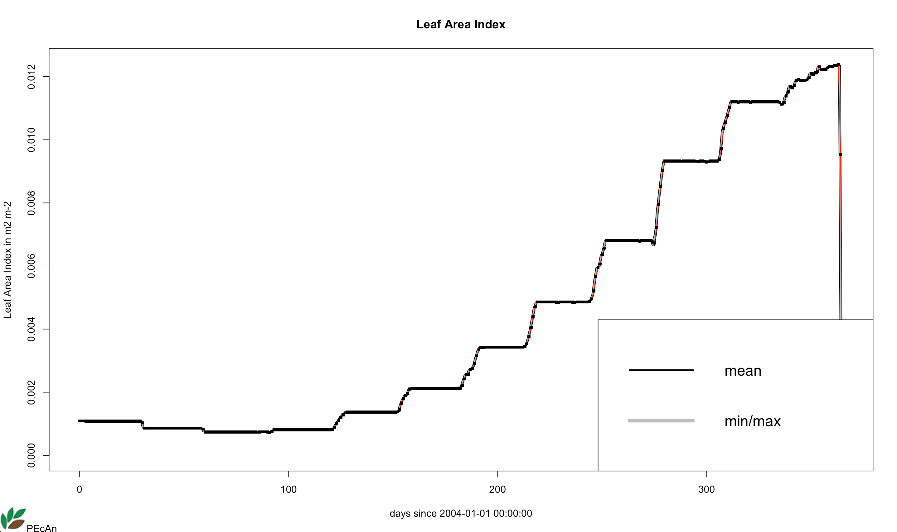

Community Dynamics Simulation
================
Kristina Riemer
3/25/2019

The specific settings chosen for sections 1-3 of this vignette,
including plant functional types (PFTs), sites, and date ranges were
chosen as examples to illustrate how to use the PEcAn infrastructure to
run the ED2 model.

# 1\. ED2 Run Using PEcAn’s Virtual Machine

The Ecosystem Demography ([ED2](https://github.com/EDmodel/ED2)) model
was run using the PEcAn VM in Virtualbox. Follow steps 1-6 in section
4.1 of the
[documentation](https://pecanproject.github.io/pecan-documentation/develop/pecan-manual-setup.html#install-vm)
to get the PEcAn virtual machine installed and running, and open the web
interface for PEcAn by going to `localhost:6480/pecan/` in the browser.

Click “Next” button, then specify the following settings on the next
page (“Select host, model, site”):

  - Host = pecan.vm
  - Model = ED2.2 (git)
  - Site Group = All Sites
  - Site = EBI Energy farm

Select “Next” button and select the following:

  - PFTs (use control+click to select multiple)
    1.  ebifarm.c3grass
    2.  ebifarm.c4crop
    3.  ebifarm.forb
  - Start Date = 2004/01/01
  - End Date = 2009/12/31
  - ED2.cohort = ebifarm.lat40.0long-88.0.css
  - ED2.patch = ebifarm.lat40lon-88.0.pss
  - ED2.site = ebifarm. lat40.0lon88.0.site
  - Ed.met\_driver\_header = ED\_MET\_DRIVER\_HEADER 2004-2009
  - Land use = Earth Land Surface
  - Soil = FAO\_
  - Thermal sums = Earth Land Surface
  - Vegetation = OGE2

Check “Edit model config” box to be able to edit the configuration file
for the model. When the **Advanced Edit** page shows up, select the
“ED2IN” file and change it to match what is
below:

``` sh
   !---------------------------------------------------------------------------------------!
   ! ED2 File output.  For all the variables 0 means no output and 3 means HDF5 output.    !
   !                                                                                       !
   ! IFOUTPUT -- Fast analysis.  These are mostly polygon-level averages, and the time     !
   !             interval between files is determined by FRQANL                            !
   ! IDOUTPUT -- Daily means (one file per day)                                            !
   ! IMOUTPUT -- Monthly means (one file per month)                                        !
   ! IQOUTPUT -- Monthly means of the diurnal cycle (one file per month).  The number      !
   !             of points for the diurnal cycle is 86400 / FRQANL                         !
   ! IYOUTPUT -- Annual output.                                                            !
   ! ITOUTPUT -- Instantaneous fluxes, mostly polygon-level variables, one file per year.  !
   ! IOOUTPUT -- Observation time output. Equivalent to IFOUTPUT, except only at the       !
   !             times specified in OBSTIME_DB.                                            !
   ! ISOUTPUT -- restart file, for HISTORY runs.  The time interval between files is       !
   !             determined by FRQHIS                                                      !
   !---------------------------------------------------------------------------------------!
   NL%IFOUTPUT = 0
   NL%IDOUTPUT = 0
   NL%IMOUTPUT = 3
   NL%IQOUTPUT = 0
   NL%IYOUTPUT = 0
   NL%ITOUTPUT = 0
   NL%IOOUTPUT = 0
   NL%ISOUTPUT = 0
   !---------------------------------------------------------------------------------------!
```

``` sh
   !---------------------------------------------------------------------------------------!
   ! ATTACH_METADATA -- Flag for attaching metadata to HDF datasets.  Attaching metadata   !
   !                    will aid new users in quickly identifying dataset descriptions but !
   !                    will compromise I/O performance significantly.                     !
   !                    0 = no metadata, 1 = attach metadata                               !
   !---------------------------------------------------------------------------------------!
   NL%ATTACH_METADATA = 1
   !---------------------------------------------------------------------------------------!
```

``` sh
   !---------------------------------------------------------------------------------------!
   ! UNITFAST  --  The following variables control the units for FRQFAST/OUTFAST, and      !
   ! UNITSTATE     FRQSTATE/OUTSTATE, respectively.  Possible values are:                  !
   !               0.  Seconds;                                                            !
   !               1.  Days;                                                               !
   !               2.  Calendar months (variable)                                          !
   !               3.  Calendar years  (variable)                                          !
   !                                                                                       !
   ! N.B.: 1. In case OUTFAST/OUTSTATE are set to special flags (-1 or -2)                 !
   !          UNITFAST/UNITSTATE will be ignored for them.                                 !
   !       2. In case IQOUTPUT is set to 3, then UNITFAST has to be 0.                     !
   !                                                                                       !
   !---------------------------------------------------------------------------------------!
   NL%UNITFAST = 1
   NL%UNITSTATE = 1
   !---------------------------------------------------------------------------------------!

   !---------------------------------------------------------------------------------------!
   ! OUTFAST/OUTSTATE -- these control the number of times per file.                       !
   !                      0. Each time gets its own file                                   !
   !                     -1. One file per day                                              !
   !                     -2. One file per month                                            !
   !                    > 0. Multiple timepoints can be recorded to a single file reducing !
   !                         the number of files and i/o time in post-processing.          !
   !                         Multiple timepoints should not be used in the history files   !
   !                         if you intend to use these for HISTORY runs.                  !
   !---------------------------------------------------------------------------------------!
   NL%OUTFAST = 0
   NL%OUTSTATE = 0
   !---------------------------------------------------------------------------------------!
```

Select the “Save” button at the bottom of the page, and then “Continue”
button in the upper left. When the job is done executing, the next page
will display **Job Finished** in the upper left corner. Select the
“Finished” button to access the results.

## Visualize results

All the Output files of the format `analysis-E-*-*-00-000000-g01.h5`
were downloaded by selecting them from the dropdown menu and selecting
the “Show Output File” button.

There is one file per month. The data format for a single month for the
variable `MMEAN_LAI_PY` is shown below. Each row is a PFT and each
column is a cohort.

``` r
library(ncdf4)
single_nc <- nc_open("ed2_results/analysis-E-2004-01-00-000000-g01.h5")
single_nc_lai <- ncvar_get(single_nc, "MMEAN_LAI_PY")
single_nc_lai
```

    ##             [,1] [,2] [,3] [,4] [,5] [,6] [,7] [,8] [,9] [,10]       [,11]
    ##  [1,] 0.06157984    0    0    0    0    0    0    0    0     0 0.002042686
    ##  [2,] 0.03313895    0    0    0    0    0    0    0    0     0 0.000000000
    ##  [3,] 0.05085608    0    0    0    0    0    0    0    0     0 0.001686965
    ##  [4,] 0.00000000    0    0    0    0    0    0    0    0     0 0.000000000
    ##  [5,] 0.00000000    0    0    0    0    0    0    0    0     0 0.000000000
    ##  [6,] 0.00000000    0    0    0    0    0    0    0    0     0 0.000000000
    ##  [7,] 0.00000000    0    0    0    0    0    0    0    0     0 0.000000000
    ##  [8,] 0.00000000    0    0    0    0    0    0    0    0     0 0.000000000
    ##  [9,] 0.00000000    0    0    0    0    0    0    0    0     0 0.000000000
    ## [10,] 0.00000000    0    0    0    0    0    0    0    0     0 0.000000000
    ## [11,] 0.00000000    0    0    0    0    0    0    0    0     0 0.000000000
    ## [12,] 0.00000000    0    0    0    0    0    0    0    0     0 0.000000000
    ## [13,] 0.00000000    0    0    0    0    0    0    0    0     0 0.000000000
    ## [14,] 0.00000000    0    0    0    0    0    0    0    0     0 0.000000000
    ## [15,] 0.00000000    0    0    0    0    0    0    0    0     0 0.000000000
    ## [16,] 0.00000000    0    0    0    0    0    0    0    0     0 0.000000000
    ## [17,] 0.00000000    0    0    0    0    0    0    0    0     0 0.000000000

Each monthly LAI dataset is summed across cohort and only the rows for
the three PFTs of interest are retained. All the monthly datasets are
combined into one.

``` r
library(dplyr)
library(tibble)

extract_lai <- function(file_path){
  nc <- nc_open(file_path)
  lai <- ncvar_get(nc, "MMEAN_LAI_PY")
  lai_df <- data.frame(lai)
  clean_lai_df <- lai_df %>% 
    transmute(LAI = rowMeans(.)) %>% 
    slice(1:3) %>% 
    add_column(PFT = c("c3grass", "c4crop", "forb"), 
             date = substr(file_path, 24, 30)) %>% 
    mutate(date = as.Date(paste0(date, "-01")))
}

nc_files <- list.files("ed2_results/", pattern = "*.h5")
nc_file_paths <- paste0("ed2_results/", nc_files)

all_lai <- lapply(nc_file_paths, extract_lai)
all_lai <- do.call(rbind, all_lai)
head(all_lai)
```

    ##           LAI     PFT       date
    ## 1 0.005783866 c3grass 2004-01-01
    ## 2 0.003012631  c4crop 2004-01-01
    ## 3 0.004776640    forb 2004-01-01
    ## 4 0.008135376 c3grass 2004-02-01
    ## 5 0.003429235  c4crop 2004-02-01
    ## 6 0.007496156    forb 2004-02-01

The LAI time series per PFT is plotted.

``` r
library(ggplot2)

ggplot(all_lai, aes(x = date, y = LAI, color = PFT)) +
  geom_line()
```

<!-- -->

# 2\. ED2 Run Using University of Arizona’s Web Interface of PEcAn

Access the web interface by navigating to <welsch.cyverse.org:8000/> in
the browser and clicking the first link in the **Applications** section
(*PEcAn web interface, from here you can run different models at
different sites.*)

Click “Next” button, then specify the following settings on the next
page (“Select host, model, site”):

  - Host = UA
  - Model = ED2.2 (git)
  - Site Group = All Sites
  - Site = Park Falls WLEF (US-PFa) (select blue site icon on map)

Select “Next” button and select the following:

  - PFT = tempconif
  - Start Date = 2004/01/01
  - End Date = 2004/12/31
  - Ed.met\_driver\_header = ED\_MET\_DRIVER\_HEADER 1995-2005
  - Land use = Earth Land Surface
  - Soil = FAO\_
  - Thermal sums = Earth Land Surface
  - Vegetation = OGE2

Select “Next” button. This leads to an **Execution Status** page. When
**Job Finished** is displayed in the upper left hand corner, the run is
complete and can see results by clicking on the “Finished” button.

Under **Outputs** section, use the drop down menu to select “2004.nc”
and hit “Show Output File” below that. This will save the results file
to your computer, which can be plotted with R using the code shown
below.

``` r
PEcAn.visualization::plot.netcdf("2004.nc", "LAI")
```

This specifically plots the leaf area index (LAI) variable, which should
appear as shown.

<!-- -->

# 3\. ED2 Run Using University of Arizona’s RStudio Instance

1.  Access RStudio in a browser by navigating to
    <welsch.cyverse.org:8787/>. Log in using your username and password,
    which can be requested [here]().

2.  Create a new folder that will hold the necessary files for the run
    in your home directory by going to the Terminal tab and typing in
    `mkdir biocro_files`. This new folder should appear in your file
    structure under the Files tab.

3.  The first needed file is an XML that contains the configuration
    information required to get the data and run the model. This example
    run is for the willow tree PFT for a site just outside of Champaign,
    Illinois using weather data from the entire year of 2004. We are
    also running ensemble and sensitivity analyses, and a meta-analysis.
    
    Create the file by clicking the new file button with the green plus
    sign in the upper left hand corner and selecting text file. Copy and
    paste the content below into this file, click the save button, and
    save this file as `pecan64.biocro.xml` in the `biocro_files` folder.

<!-- end list -->

``` r
<pecan>
  <outdir>biocro_results</outdir>

  <database>
    <bety>
      <driver>PostgreSQL</driver>
      <user>bety</user>
      <password>bety</password>
      <host>postgres</host>
      <dbname>bety</dbname>
      <write>FALSE</write>
    </bety>
    <dbfiles>biocro_results/dbfiles</dbfiles>
  </database>

  <pfts>
    <pft>
      <name>salix</name>
    </pft>
  </pfts>

  <ensemble>
    <variable>AbvGrndWood</variable>
  </ensemble>

  <meta.analysis>
    <iter>3000</iter>
    <random.effects>FALSE</random.effects>
    <threshold>1.2</threshold>
    <update>AUTO</update>
  </meta.analysis>

  <sensitivity.analysis>
    <quantiles>
      <sigma>-1</sigma>
      <sigma>1</sigma>
    </quantiles>
    <variable>AbvGrndWood</variable>
  </sensitivity.analysis>

  <model>
    <type>BIOCRO</type>
    <binary>/home/kristinariemer/pecan/models/biocro/inst/biocro.Rscript</binary>
    <revision>1.0</revision>
  </model>

  <run>
    <site>
      <id>753</id>
    </site>
    <inputs>
      <met>
        <output>BIOCRO</output>
        <path>/home/kristinariemer/pecan/models/biocro/tests/testthat/data/US-Bo1</path>
      </met>
    </inputs>
      <start.date>2004/01/01</start.date>
      <end.date>2004/12/30</end.date>
    <host>
      <name>localhost</name>
    </host>
  </run>
</pecan>
```

4.  The second file that needs to be created is an R script that runs
    through all of PEcAn’s functions to run the model and produce the
    output. Create this file by clicking on the new file button and
    selecting R script. Copy and paste the below text into the new
    script and save in the `biocro_files` folder as `workflow.R`.

<!-- end list -->

``` r
#!/usr/bin/env Rscript
#-------------------------------------------------------------------------------
# Copyright (c) 2012 University of Illinois, NCSA.
# All rights reserved. This program and the accompanying materials
# are made available under the terms of the 
# University of Illinois/NCSA Open Source License
# which accompanies this distribution, and is available at
# http://opensource.ncsa.illinois.edu/license.html
#-------------------------------------------------------------------------------

# ----------------------------------------------------------------------
# Load required libraries
# ----------------------------------------------------------------------
library(PEcAn.all)
library(PEcAn.utils)
library(RCurl)

# make sure always to call status.end
options(warn=1)
options(error=quote({
  PEcAn.utils::status.end("ERROR")
  PEcAn.remote::kill.tunnel(settings)
  if (!interactive()) {
    q(status = 1)
  }
}))

#options(warning.expression=status.end("ERROR"))


# ----------------------------------------------------------------------
# PEcAn Workflow
# ----------------------------------------------------------------------
# Open and read in settings file for PEcAn run.
args <- commandArgs(trailingOnly = TRUE)
if (is.na(args[1])){
  settings <- PEcAn.settings::read.settings("pecan.xml") 
} else {
  settings.file <- args[1]
  settings <- PEcAn.settings::read.settings(settings.file)
}

# Check for additional modules that will require adding settings
if("benchmarking" %in% names(settings)){
  library(PEcAn.benchmark)
  settings <- papply(settings, read_settings_BRR)
}

if("sitegroup" %in% names(settings)){
  if(is.null(settings$sitegroup$nSite)){
    settings <- PEcAn.settings::createSitegroupMultiSettings(settings, 
                                                             sitegroupId = settings$sitegroup$id)
  } else {
    settings <- PEcAn.settings::createSitegroupMultiSettings(settings, 
                                                             sitegroupId = settings$sitegroup$id,
                                                             nSite = settings$sitegroup$nSite)
  }
  settings$sitegroup <- NULL ## zero out so don't expand a second time if re-reading
}

# Update/fix/check settings. Will only run the first time it's called, unless force=TRUE
settings <- PEcAn.settings::prepare.settings(settings, force = FALSE)

# Write pecan.CHECKED.xml
PEcAn.settings::write.settings(settings, outputfile = "pecan.CHECKED.xml")

# start from scratch if no continue is passed in
statusFile <- file.path(settings$outdir, "STATUS")
if (length(which(commandArgs() == "--continue")) == 0 && file.exists(statusFile)) {
  file.remove(statusFile)
}

# Do conversions
settings <- PEcAn.workflow::do_conversions(settings)

# Query the trait database for data and priors
if (PEcAn.utils::status.check("TRAIT") == 0){
  PEcAn.utils::status.start("TRAIT")
  settings <- PEcAn.workflow::runModule.get.trait.data(settings)
  PEcAn.settings::write.settings(settings, outputfile='pecan.TRAIT.xml')
  PEcAn.utils::status.end()
} else if (file.exists(file.path(settings$outdir, 'pecan.TRAIT.xml'))) {
  settings <- PEcAn.settings::read.settings(file.path(settings$outdir, 'pecan.TRAIT.xml'))
}


# Run the PEcAn meta.analysis
if(!is.null(settings$meta.analysis)) {
  if (PEcAn.utils::status.check("META") == 0){
    PEcAn.utils::status.start("META")
    PEcAn.MA::runModule.run.meta.analysis(settings)
    PEcAn.utils::status.end()
  }
}

# Write model specific configs
if (PEcAn.utils::status.check("CONFIG") == 0){
  PEcAn.utils::status.start("CONFIG")
  settings <- PEcAn.workflow::runModule.run.write.configs(settings)
  PEcAn.settings::write.settings(settings, outputfile='pecan.CONFIGS.xml')
  PEcAn.utils::status.end()
} else if (file.exists(file.path(settings$outdir, 'pecan.CONFIGS.xml'))) {
  settings <- PEcAn.settings::read.settings(file.path(settings$outdir, 'pecan.CONFIGS.xml'))
}

if ((length(which(commandArgs() == "--advanced")) != 0) && (PEcAn.utils::status.check("ADVANCED") == 0)) {
  PEcAn.utils::status.start("ADVANCED")
  q();
}

# Start ecosystem model runs
if (PEcAn.utils::status.check("MODEL") == 0) {
  PEcAn.utils::status.start("MODEL")
  PEcAn.remote::runModule.start.model.runs(settings, stop.on.error = FALSE)
  PEcAn.utils::status.end()
}

# Get results of model runs
if (PEcAn.utils::status.check("OUTPUT") == 0) {
  PEcAn.utils::status.start("OUTPUT")
  runModule.get.results(settings)
  PEcAn.utils::status.end()
}

# Run ensemble analysis on model output.
if ('ensemble' %in% names(settings) & PEcAn.utils::status.check("ENSEMBLE") == 0) {
  PEcAn.utils::status.start("ENSEMBLE")
  runModule.run.ensemble.analysis(settings, TRUE)
  PEcAn.utils::status.end()
}

# Run sensitivity analysis and variance decomposition on model output
if ('sensitivity.analysis' %in% names(settings) & PEcAn.utils::status.check("SENSITIVITY") == 0) {
  PEcAn.utils::status.start("SENSITIVITY")
  runModule.run.sensitivity.analysis(settings)
  PEcAn.utils::status.end()
}

# Run parameter data assimilation
if ('assim.batch' %in% names(settings)) {
  if (PEcAn.utils::status.check("PDA") == 0) {
    PEcAn.utils::status.start("PDA")
    settings <- PEcAn.assim.batch::runModule.assim.batch(settings)
    PEcAn.utils::status.end()
  }
}

# Run state data assimilation
if ('state.data.assimilation' %in% names(settings)) {
  if (PEcAn.utils::status.check("SDA") == 0) {
    PEcAn.utils::status.start("SDA")
    settings <- sda.enfk(settings)
    PEcAn.utils::status.end()
  }
}

# Run benchmarking
if("benchmarking" %in% names(settings) & "benchmark" %in% names(settings$benchmarking)){
  PEcAn.utils::status.start("BENCHMARKING")
  results <- papply(settings, function(x) calc_benchmark(x, bety))
  PEcAn.utils::status.end()
}

# Pecan workflow complete
if (PEcAn.utils::status.check("FINISHED") == 0) {
  PEcAn.utils::status.start("FINISHED")
  PEcAn.remote::kill.tunnel(settings)
  db.query(paste("UPDATE workflows SET finished_at=NOW() WHERE id=",
                 settings$workflow$id, "AND finished_at IS NULL"),
           params = settings$database$bety)
  
  # Send email if configured
  if (!is.null(settings$email) && !is.null(settings$email$to) && (settings$email$to != "")) {
    sendmail(settings$email$from, settings$email$to,
             paste0("Workflow has finished executing at ", base::date()),
             paste0("You can find the results on ", settings$email$url))
  }
  PEcAn.utils::status.end()
}

db.print.connections()
print("---------- PEcAn Workflow Complete ----------")
```

#### add ed2 binary

how to add binary file? had to get permissions using chmod u+x
ed2\_files/ed2.git

5.  We will then run the newly created XML file through the R script.
    First create a new folder in which to store the results by executing
    `mkdir biocro_results` in the Terminal. Then in the Terminal run
    `biocro_files/workflow.R --settings
    biocro_files/pecan64.biocro.xml`. This will take a few minutes to
    finish. The last line in the console should appear as follows.

<!-- end list -->

``` r
[1] "---------- PEcAn Workflow Complete ----------"
```

6.  To test if this works, plot the output data for leaf area index
    across time. In the console or a new R script, type the following R
    command and the plot shown should be
generated.

<!-- end list -->

``` r
PEcAn.visualization::plot.netcdf("biocro_results/out/SA-salix-chi_leaf-0.159/2004.nc", "LAI")
```
